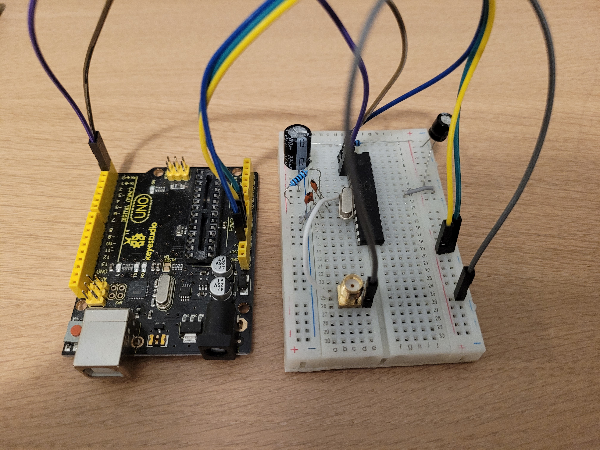

# atmega_spa

(WIP)

Password recovery via SPA on atmega328p, using a Rigol DS1102Z-E.

The hardware setup and the code runing on the MCU (src/spa.ino) are taken from "The Hardware Hacking Handbook, Breaking Embedded Security with Hardware Attacks" by Colin O'Flynn and Jasper van Woudenberg.

One probe is connected to the shunt resistor, the other one to pin 4, used as trigger.

Library used for comunicating with the oscilloscope (instruments.py) is forked from https://github.com/nathankjer/instruments, with some minor changes.
